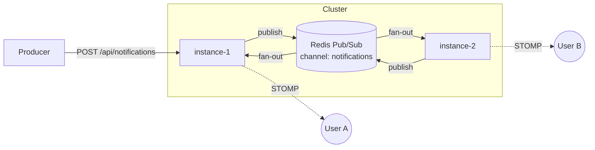

# Realtime Messaging

A horizontally-scalable real-time notification/messaging backend built on Spring Boot 4 and
STOMP-over-WebSocket. The interesting part isn't "push a message to a browser" — it's doing that
**correctly when there is more than one server**.

> **Status:** active build. Milestone 1 (cross-instance routing) is implemented and demoable.
> Milestones 2–4 are designed and tracked below. This README is intentionally honest about what
> runs today vs. what is roadmap.


---

## The problem

A single-server WebSocket app is easy: the server holds the connection, so it can push to it
directly. That model breaks the moment you scale out:

1. **Cross-instance routing** — User A is connected to `instance-1`. An event for A is produced on
   `instance-2`. `instance-2` has no socket to A. How does the message find A?
2. **Delivery guarantees** — A's phone is in a tunnel. The notification is produced while A is
   connected to *no* instance. Where does it go so A gets it on reconnect — without loss or dupes?
3. **Fan-out at scale** — One event must reach 50k subscribers. How do connections, backpressure,
   and broker load behave, and where does it fall over?

This project takes each in turn, measures it, and writes down the trade-offs.

## Architecture



Publish path: `REST → NotificationPublisher → Redis channel`. Every instance subscribes to the same
channel; on receipt each instance delivers **only to its own local sessions**
(`RedisNotificationSubscriber` + `SessionRegistry`). A uniquely-targeted user connected to one
instance is therefore delivered to exactly once; a broadcast reaches each subscriber via its own
instance. See [ADR-0002](docs/adr/0002-redis-pubsub-for-scale-out-routing.md).

## Hard problems — status

| # | Problem | Approach | Status |
|---|---------|----------|--------|
| 1 | Cross-instance routing | Redis Pub/Sub fan-out + per-instance local delivery | ✅ implemented |
| 1b | Per-instance presence | Reference-counted `SessionRegistry` via STOMP connect/disconnect events | ✅ implemented |
| 2 | Durable delivery (offline inbox, no loss/dupes) | Redis-backed per-user inbox + replay on connect | ⏳ designed — [ADR-0003](docs/adr/0003-delivery-guarantee-roadmap.md) |
| 3 | Fan-out at scale | k6 soak + throughput suites, p99 / drop-rate thresholds | ⏳ harness scaffolded, numbers pending |
| 4 | Durable ingestion | Kafka as the replayable event source feeding the fan-out | ⏳ dependency wired, listener pending |

## Tech stack

- **Java 21**, **Spring Boot 4.1** (Spring Framework 7)
- **STOMP over WebSocket** for the client protocol
- **Redis Pub/Sub** for cross-instance routing (Lettuce)
- **Kafka** for durable event ingestion *(roadmap)*
- **Micrometer + Prometheus + Grafana** for observability
- **Testcontainers** for integration tests against real Redis/Kafka
- **k6** for load testing

## Quickstart

Requires JDK 21 (bundled Gradle wrapper) and Docker.

```bash
# 1. start infrastructure (Redis, Kafka, Prometheus, Grafana)
docker compose up -d

# 2. run the app
./gradlew bootRun

# 3. open the demo client
open http://localhost:8080
```

### Prove cross-instance routing (the money demo)

Run two instances:

```bash
SERVER_PORT=8080 INSTANCE_ID=instance-1 ./gradlew bootRun
SERVER_PORT=8081 INSTANCE_ID=instance-2 ./gradlew bootRun
```

Open `http://localhost:8080` and `http://localhost:8081` in two tabs, connect both, and publish a
broadcast from either. Both tabs receive it — although each is connected to a different JVM — because
the message travels through Redis. Target a specific `user` to see direct, exactly-once delivery.

## Observability

`docker compose up` also starts Prometheus (`:9090`) and Grafana (`:3000`, admin/admin). The app
exposes `/actuator/prometheus`; Prometheus scrapes both instances. Useful series: active WebSocket
sessions, publish rate, end-to-end delivery latency.

## Load testing

k6 scenarios live in [`load-test/`](load-test/): `ws-soak.js` holds N concurrent STOMP connections;
`publish-throughput.js` hammers the ingest endpoint. See [`load-test/README.md`](load-test/README.md).
Headline numbers will be published here once Milestone 3 lands — with the before/after of each
optimization, not just a final figure.

## Security note

The demo resolves the user from a `?user=` query param at handshake (`UserHandshakeHandler`) to keep
the focus on the distributed-systems problem. A production deployment would swap this for a
JWT/session-validating handshake interceptor; the rest of the routing logic is unchanged.

## Project layout

```
src/main/java/com/portfolio/realtime
├── config/        WebSocket (STOMP) + Redis listener wiring
├── gateway/       handshake → Principal, per-instance presence registry
└── notification/  REST ingress, Redis publish, Redis→WebSocket delivery
docs/
├── architecture.md
└── adr/           Architecture Decision Records
load-test/         k6 scenarios
monitoring/        Prometheus + Grafana provisioning
```

## Decision records

- [ADR-0001 — WebSocket vs SSE](docs/adr/0001-websocket-vs-sse.md)
- [ADR-0002 — Redis Pub/Sub for cross-instance routing](docs/adr/0002-redis-pubsub-for-scale-out-routing.md)
- [ADR-0003 — Delivery-guarantee roadmap](docs/adr/0003-delivery-guarantee-roadmap.md)
