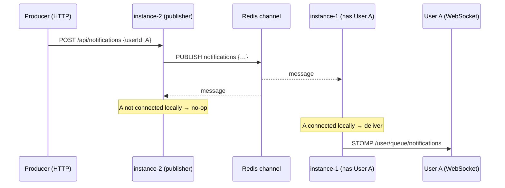

# Architecture

## Goals & non-goals

**Goals**
- Deliver real-time messages correctly across a horizontally-scaled cluster.
- Make every design trade-off explicit and measurable.
- Keep the local developer loop simple (one `docker compose up`, one `bootRun`).

**Non-goals (for now)**
- AuthN/AuthZ beyond a demo handshake (see README security note).
- Multi-region / geo-replication.
- Message history / search (this is delivery, not storage).

## Components

| Component | Responsibility |
|-----------|----------------|
| `NotificationController` | HTTP ingress; validates, stamps id + timestamp, returns 202. |
| `NotificationPublisher` | Serializes and publishes to the cluster-wide Redis channel. |
| `RedisMessageListenerContainer` | Subscribes this instance to the Redis channel. |
| `RedisNotificationSubscriber` | Receives every message; delivers to local sessions only. |
| `SessionRegistry` | Per-instance presence, reference-counted over STOMP connect/disconnect. |
| `WebSocketConfig` | STOMP broker + endpoint; pins JSON converter to the app `ObjectMapper`. |
| `UserHandshakeHandler` | Resolves a `Principal` from `?user=` at handshake. |

## Message flow

## Why this is the hard part

The in-memory STOMP "simple broker" only knows sessions on its own JVM. Two instances each have a
partial view of who is online. Redis Pub/Sub turns "deliver to user X" into "tell every instance,
let whichever one holds X deliver" — at the cost of every instance seeing every message (fine for
moderate fan-out, revisited under load in Milestone 3). The alternative — a shared external broker
that natively routes user destinations (e.g. RabbitMQ STOMP relay) — is evaluated in ADR-0002.

## Delivery semantics

- **Today:** at-most-once. If the recipient is connected, they get it; if not, it is dropped.
- **Target (ADR-0003):** at-least-once with client-side dedup by message id — a durable per-user
  inbox persists undelivered messages and replays them on reconnect.

## Observability

Micrometer exports to Prometheus at `/actuator/prometheus`. Planned custom metrics: active sessions
per instance (`SessionRegistry.localUserCount()`), publish counter, and an end-to-end delivery
latency timer (producer stamp → client receive) sampled via the load-test client.
